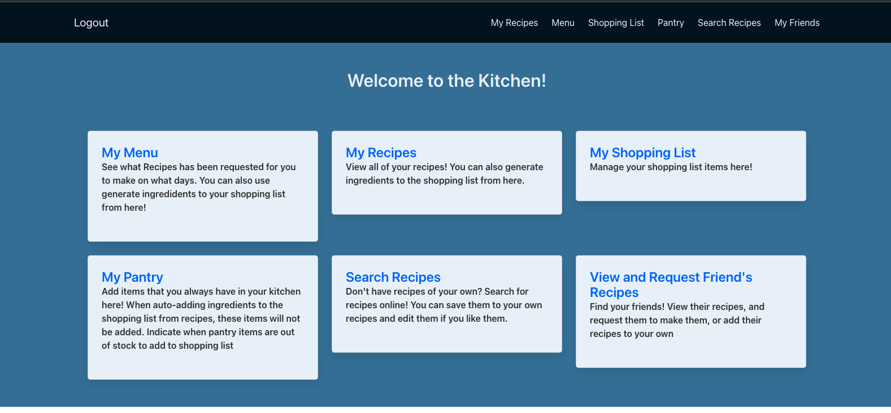
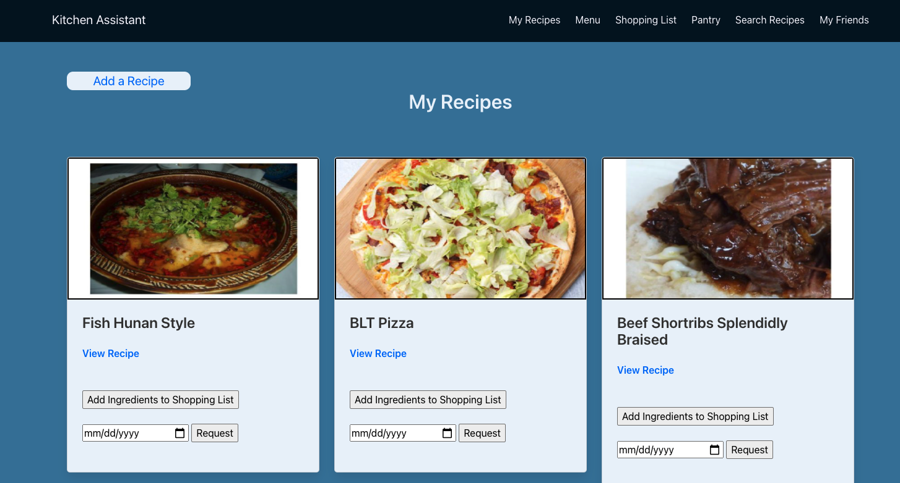
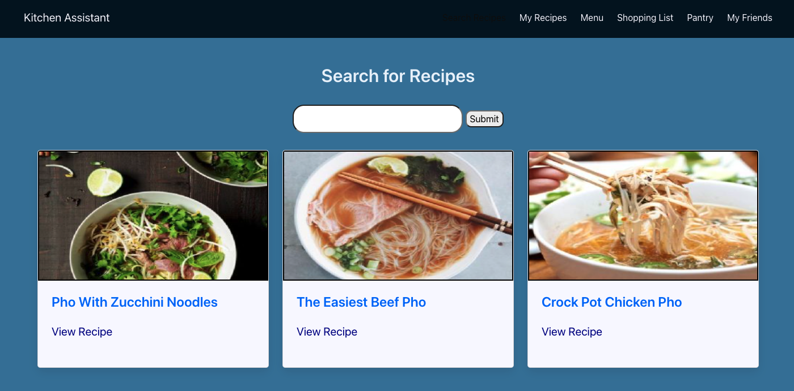
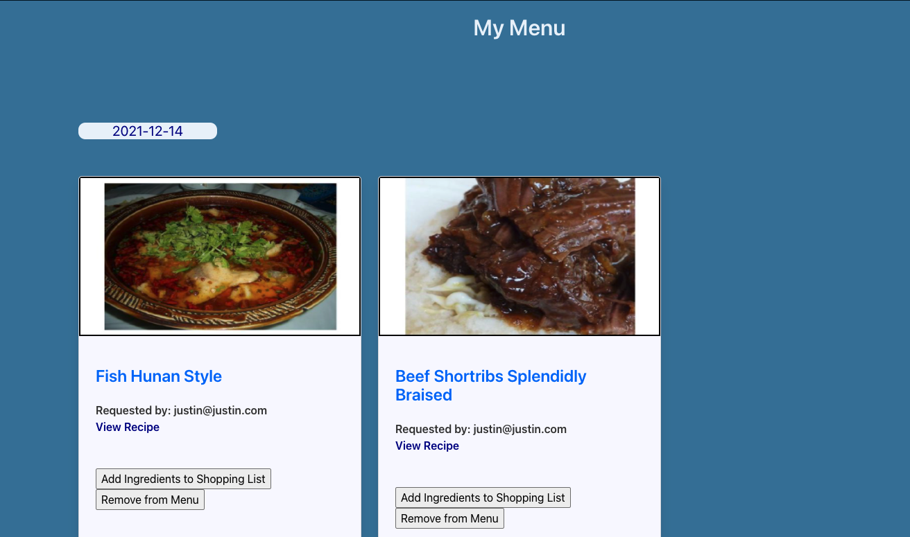
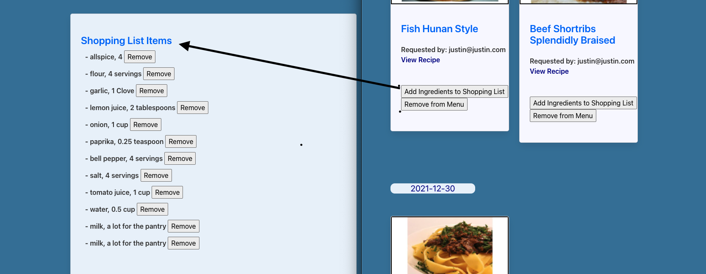
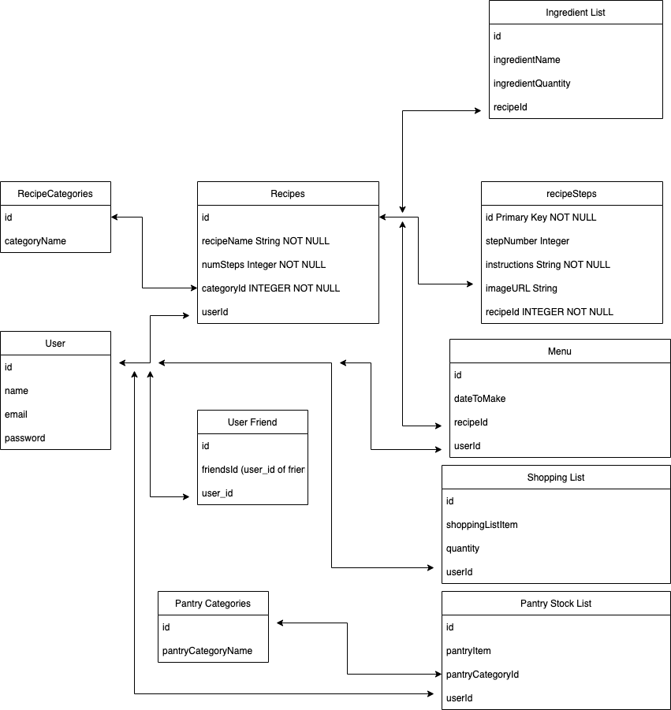

# Kitchen-Assistant

A special someone to help you efficiently manage your kitchen so you can spend more time on the important things. Create your own recipes, find new ones, see what's on the menu for the day or week, and automatically generate your shopping lists!

[Kitchen-Assistant via Heroku](https://kitchen-assistant-1025.herokuapp.com/)

[Kitchen-Assistant Github Repository](https://github.com/justinluu8235/kitchen-assistant)




## User Stories
1. RESTful routes for recipe creation and display 
- I want to view my recipes 
- I want to create a recipe based on a dynamic form
- I want to delete a recipe
- I want to edit a recipe

2. What's on the Menu page
- When i view the page, I want to see a breakout of each day of the week 
- I want to see a date, and what recipes I will be making that day
- Next to each day, or week, I want a option to take those recipes, and generate a shopping list

3. Shopping List
- I want to see a list of items to buy, along with quantity
- I want the option to add, delete, or edit items


4. Pantry Manager
- I want to see a list of items that I always have in my pantry 
- I want to perform CRUD operations on these
- I want to have these items excluded from my shopping list when I generate shopping list bassed on recipes


5. Search Recipes 
- I want to search recipes from Spoonacular API
- I want to take recipes found and add them to my recipes.


---

## Key Features

- Manage Your Recipes

  - 

- Search for New Recipes to add to your own

  - 

- Plan your Menu, and request Friend's to cook their recipes

  - 

- Generate Shopping List from Recipes

   - 


## Entity Relationship Diagram
The following ERD details the associations between the user, recipes, and other data.



The database was created using the sequelize ORM. Associations were made between models as shown: 

```js
static associate(models) {
      // define association here
      models.Recipe.belongsTo( models.RecipeCategory, { foreignKey: 'recipeCategoryId' } );
      models.Recipe.belongsTo( models.User, { foreignKey: 'userId' } );
      models.Recipe.hasMany(models.IngredientList, { foreignKey: 'recipeId' });
      models.Recipe.hasMany(models.RecipeStep, { foreignKey: 'recipeId' });
      models.Recipe.hasMany(models.Menu, { foreignKey: 'recipeId' });
    }
```

### Spoonacular API

Recipe and Ingredient information are fetched from the Spoonacular API. 

```js
    let response;
    let queryResultsQuantity = 20;
    let recipeTitleArr;
    let idArr;
    let imageURLArr;
    try{
        response = await axios.get(`https://api.spoonacular.com/recipes/complexSearch?query=${query}&apiKey=${API_KEY}&number=${queryResultsQuantity}`)
        response = response.data.results; //array
        recipeTitleArr = new Array(response.length);
        idArr = new Array(response.length);
        imageURLArr = new Array(response.length);
        for(let i=0; i<response.length; i++){
            recipeTitleArr[i] = response[i].title;
            idArr[i] = response[i].id;
            imageURLArr[i] = response[i].image;
        }
    }
    catch (err) {
        console.log(err);
    }
```

Followed by parsing of the data

```js
    let apiRecipeId = req.params.id;
    let recipeName;
    let image;
    let ingredientsObj = {};
    ingredientsObj.ingredientNameArr = [];
    ingredientsObj.ingredientQuantityArr = [];
    ingredientsObj.quantityUnitArr = [];
    let instructionsObj = {};
    instructionsObj.stepNumberArr = [];
    instructionsObj.instructionsArr = [];
    //Grab ingredients list and organize into ingredientsObj
    try{
        let response = await axios.get(`https://api.spoonacular.com/recipes/${apiRecipeId}/information?apiKey=${API_KEY}&includeNutrition=false`)
        response = response.data;
        recipeName = response.title;
        image = response.image;
        for(let i=0; i<response.extendedIngredients.length; i++){
            let ingredient = response.extendedIngredients[i];
            ingredientsObj.ingredientNameArr.push(ingredient.name);
            ingredientsObj.ingredientQuantityArr.push(ingredient.amount);
            ingredientsObj.quantityUnitArr.push(ingredient.unit);
        }
    }
    catch (err) {
        console.log(err);
    }
    //Get the recipe instructions 
    try{
        let response = await axios.get(`https://api.spoonacular.com/recipes/${apiRecipeId}/analyzedInstructions?apiKey=${API_KEY}`)
        response = response.data[0].steps; //array
        for(let i=0; i<response.length; i++){
            let instruction = response[i];
            instructionsObj.stepNumberArr.push(instruction.number);
            instructionsObj.instructionsArr.push(instruction.step);
        }
        
    }
    catch (err) {
        console.log(err);
    }
  ```


### RESTful Routing

The following table illustrates the routes that are used by the server to allow a user to navigate between views and interact with the database.

 Verb | URL | Description
 ----------- | ----------- | -----------
 GET | / | Home Page
 GET | /auth/login |  Log in screen
 GET | /auth/signup | Sign up screen for new account
 GET | /auth/logout |  Log out of current account
 POST | /auth/login |  Log in to an existing account
 POST | /auth/signup |  Sign up and log in
 GET | /recipes |  display all user's recipes
 GET | /recipes/new | Create a new recipe
 GET | /recipes/edit/:id | Edit an individual recipe
 GET | /recipes/:id | display an individual recipe
 POST | /recipes | Create a Recipe based on name, ingredients, and instructions provided
 POST | /recipes/:id | Create shopping list items based on a recipe's ingredients
 PUT | /recipes/:id |  Save edited data of a recipe, its ingredients, and instructions
 DELETE | /recipes/:id |  delete a recipe, and any associated menu item
 GET | /searchRecipes |  search for a recipe on spoonacular API
 GET | /searchRecipes/view/:id |  View an individual recipe from spoonacular API
 GET | /searchRecipes/:query |  Displays the queried recipe search from spoonacular API
 POST | /searchRecipes | Takes in recipe search query and redirects to results display route
 POST | /searchRecipes/getRecipe |  Get a spoonacular Recipe information and save to database
 GET | /shoppingList |  display shopping list items
 POST | /shoppingList |  Create a shopping list item
 GET | /menu |  Display recipes requested to make by date
 POST | /menu/:id |  Creates a menu item when requested from Recipes
 DELETE | /menu/:id |  Delete a menu item
 GET | /pantry |  View all pantry items 
 POST | /pantry|  Create a pantry item
 PUT | /pantry/:id |  Update whether a pantry item is in stock, and add to shopping list if not
 DELETE | /pantry/:id |  Delete a pantry item
 GET | /userFriends |  View all of the user's friends
 GET | /userFriends/search |  Search for friends by email
 GET | /userFriends/user/:id |  View all the recipes from a friend
 GET | /userFriends/user/recipe/:id |  View an individual recipe from a user's friend
 POST | /userFriends|  Checks whether another user exists, or is a friend
 POST | /userFriends/add/:id |  Add a friend
 POST | /userFriends/save/:id |  Make a copy of a friends recipe
 POST | /userFriends/:id | Request a friend to make a recipe
 DELETE | /userFriends/:id |  Delete a friend 

 

Example of a route: 
```js
//Take in recipe name, ingredients, instructions and create a recipe 
router.post('/', isLoggedIn, async function (req, res) {
    let userId = req.user.get().id;

    //Create a Recipe and grab its id
    let recipeId = await addRecipe(userId, req.body.recipeName, req.body.categoryName);
    for (let i = 0; i < req.body.ingredientName.length; i++) {
        await addIngredients(recipeId, req.body.ingredientName[i], req.body.ingredientQuantity[i], req.body.quantityUnit[i]);
    }

    for (let i = 0; i < req.body.instructions.length; i++) {
        await addRecipeSteps(recipeId, i + 1, req.body.instructions[i]);
    }

    res.redirect(`recipes/${recipeId}`);
});
``` 
